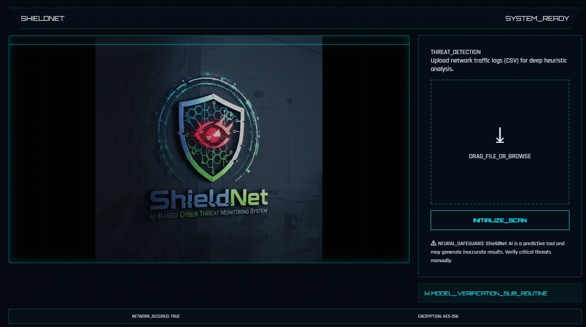
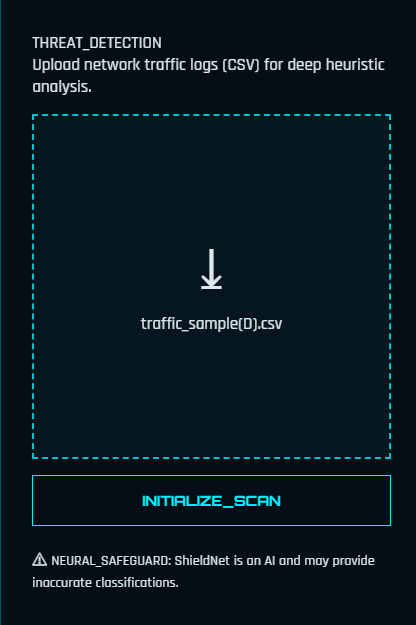
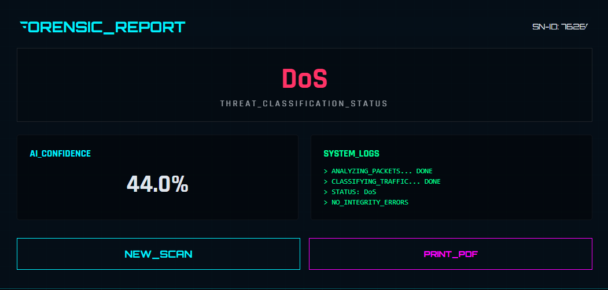
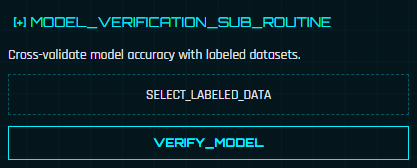
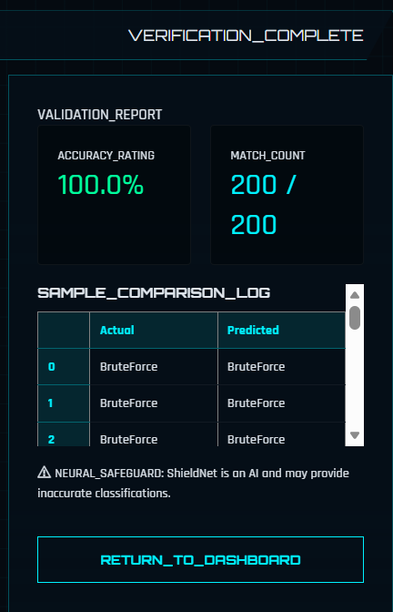
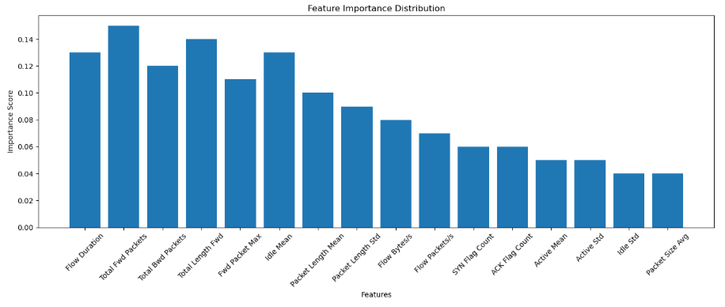

# ShieldNet - AI Based Cyber Threat Monitoring System 

ShieldNet is a **B.Tech Major Project** developed to detect malicious cyber activities using **Machine Learning** and **Deep Learning** techniques. The system analyzes network traffic data and classifies attacks in real time through an interactive web application.

---

##  Project Overview

Cyber threats are increasing rapidly, and traditional security systems often fail to detect modern attack patterns efficiently. ShieldNet was developed to provide an intelligent solution for identifying suspicious traffic using AI models trained on real-world intrusion datasets.

The project uses the **CIC-IDS2017** dataset and supports multi-class attack detection.

---

##  Key Features

- AI-powered cyber threat detection system  
- Multi-class attack classification  

### Detects:

- Benign Traffic  
- DoS Attack  
- DDoS Attack  
- PortScan  
- BruteForce Attack  

### Additional Features:

- Data preprocessing and feature engineering  
- SMOTE-based class balancing  
- Deep Neural Network with Attention mechanism  
- Flask-based web interface for real-time predictions  
- Verification module using sample traffic records  

---

##  Tech Stack

- **Frontend:** HTML, CSS  
- **Backend:** Flask (Python)  
- **Machine Learning:** Scikit-learn  
- **Deep Learning:** TensorFlow / Keras  
- **Data Processing:** Pandas, NumPy  
- **Model Serialization:** Joblib, H5PY  

---

##  Dataset Used

**CIC-IDS2017** – A benchmark intrusion detection dataset containing multiple cyber attack scenarios and benign traffic.

Raw attack datasets were merged, preprocessed, and transformed into a unified training dataset.

---

##  Models Explored

- Logistic Regression  
- Random Forest  
- Support Vector Machine  
- Decision Tree  
- Deep Neural Network (Final Model)  
- DNN with Attention Mechanism  

---

##  Screenshots

### Main Dashboard



### Threat Detection Module



### Threat Detection Result



### Verification Module



### Verification Result



### Feature Comparison



---

## ⚙️ Installation & Setup

### 1️⃣ Clone Repository

```bash
git clone https://github.com/kushalc05/ShieldNet-AI.git
cd ShieldNet

2️⃣ Install Dependencies
pip install -r requirements.txt

3️⃣ Run Application
python app.py

🌐 Access Application
Open your browser and visit:
http://127.0.0.1:5000/

👥 Team Members
Kushal – Team Lead
Kishan N
Lalithkiran S

🎓 Project Guide
Mahesh Kumar VB

📚 Learning Outcomes
This project helped us gain practical experience in:
Cybersecurity Concepts
Machine Learning & Deep Learning
Flask Deployment
Data Engineering
Team Collaboration
Real-world Problem Solving

🔮 Future Enhancements
Real-time live packet monitoring
Cloud deployment
Explainable AI for threat reasoning
Advanced ensemble models
Mobile dashboard integration

📜 License
This project is developed for academic and educational purposes.

⭐ Support
If you found this project interesting, consider giving it a star.